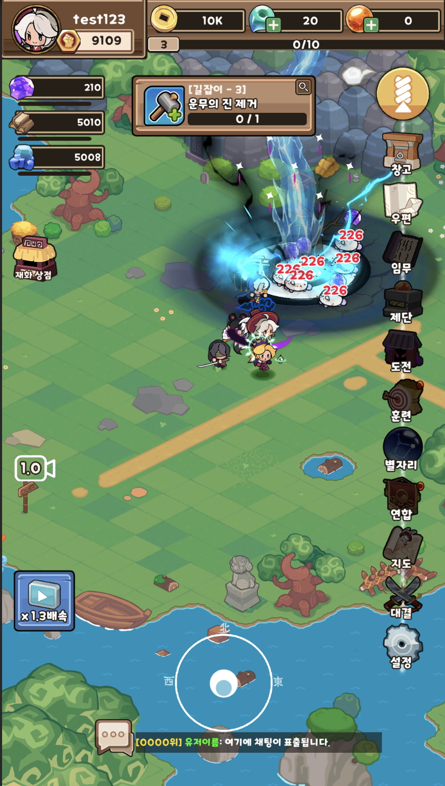
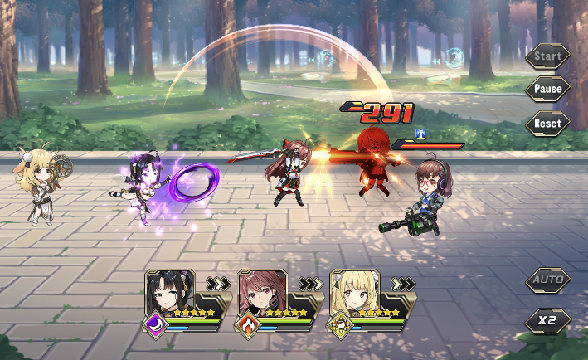
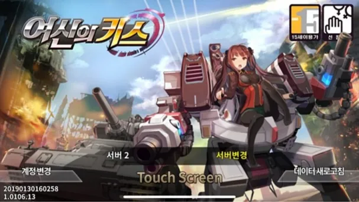

# 👋 Unity 클라이언트 개발자 <!-- TODO: 이름 -->

수집형 RPG를 중심으로 **전투 로직, UI 시스템, 리소스 패치 시스템**을 개발해 온 Unity 클라이언트 개발자입니다.

<!-- TODO: 한두 줄 자기소개 (경력 연차, 관심 분야 등) -->

## 🎮 Projects

<table>
  <tr>
    <td width="33%" align="center" valign="top">
       
      <b><a href="jeonwoochi/README.md">전우치 - 도사열전</a></b> 
      2025.01 ~ 2026.05 · Unity 2022.3  
      수집형 RPG 
      <b>우르르 용병단식 스쿼드 필드 전투</b> 
      필드 전투 · 스쿼드 이동 · 던전 · Addressable 패치
    </td>
    <td width="33%" align="center" valign="top">
       
      <b><a href="ove/README.md">OVE GENERATION</a></b> 
      2019.01 ~ 2020.02 · Unity 2018.4  
      미소녀 수집형 RPG 
      <b>프리코네식 실시간 사이드 뷰 오토 배틀</b> 
      전투 로직 · 캐릭터 FSM · 스킬 · 전투 연출
    </td>
    <td width="33%" align="center" valign="top">
       
      <b><a href="goddesskiss/README.md">여신의 키스</a></b> 
      2015.05 ~ 2019.12 · Unity 2018.4  
      서브컬처 미소녀 수집형 RPG 
      <b>UI 시스템 / 컨텐츠 개발</b> 
      UIManager · 팝업 구조 · 가챠 · 길드 · 덱 편성
    </td>
  </tr>
</table>

| 프로젝트 | 핵심 구현 |
| --- | --- |
| [전우치 - 도사열전](jeonwoochi/README.md) | 메인 캐릭터 중심 대열 이동, PolyNav 경로 탐색 최적화, Spine 이벤트 기반 다단 타격, CDN 전환 가능한 Addressable 패치 |
| [OVE GENERATION](ove/README.md) | 고정 틱 + 시드 난수 전투, 필살기 대기열, SLATE / AVPro 필살기 연출, 진형 배치표 |
| [여신의 키스](goddesskiss/README.md) | 화면 지연 생성 / 캐싱, NGUI depth 정규화, 팝업 스택과 코루틴 결과 대기 |

## 🛠 Tech Stack

- **Engine / Language**: Unity3D, C#
- **UI**: NGUI, UGUI
- **Animation / 연출**: Spine, SLATE Cinematic Sequencer, AVPro Video
- **Async / Reactive**: UniTask, UniRx
- **Network**: BestHTTP
- **Resource**: Addressable System
- **ETC**: PolyNavMesh, TileMap, Chronos

> 📂 각 프로젝트의 **전체 코드는 요청 시 공유 가능합니다.** (비공개 저장소 — 요청해 주시면 열람 권한을 드립니다)

## 📫 Contact

<!-- TODO: 이메일 / 블로그 등 연락처 -->
