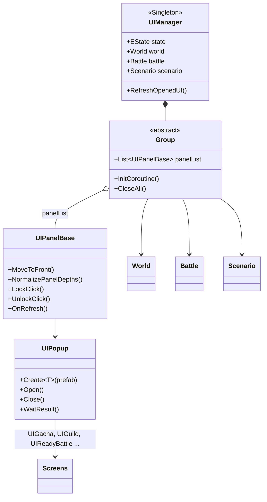

# 여신의 키스 (Goddess Kiss) — UI 클라이언트 코드

<p align="center">
  <a href="https://www.youtube.com/watch?v=23CLx9fQDdE">
    
  </a>
  <br>
  <sub>▶ 공식 트레일러 (이미지를 누르면 YouTube에서 재생됩니다)</sub>
</p>

> 모바일 게임 **「여신의 키스」** 클라이언트 개발 중 담당한 **UI 시스템** 코드를 포트폴리오용으로 정리한 문서입니다.
> 전체 프로젝트가 아닌 담당 파트 일부이며, 서버 통신·데이터 클래스 등 외부 의존 코드는 포함되어 있지 않아 단독으로 빌드되지 않습니다.
>
> 📂 **전체 코드는 요청 시 공유 가능합니다.** (비공개 저장소 — 요청해 주시면 열람 권한을 드립니다)

## 프로젝트 정보

| 항목 | 내용 |
| --- | --- |
| 장르 | 서브컬쳐 미소녀 수집형 RPG
| 플랫폼 | Android, IOS, WebGL, Windows |
| 개발 기간 | 2015.05 ~ 2019.12 |
| 팀 구성 | 클라이언트 6명, 서버 3명, 기획 5명 아트 10명 |
| 개발 환경 | Unity3D 2018.4.10 |
| 사용 에셋 및 라이브러리 | NGUI, Spine, BestHTTP, Stan's Assets |
| 담당 역할 | Unity 클라이언트 — UI 시스템 구조 및 콘텐츠 화면 구현 |

## 기술 스택

- **Engine**: Unity3D 2018.4.10
- **Language**: C#
- **UI**: NGUI (UIPanel / UIRoot / UICamera 기반 depth·입력 관리)
- **Animation**: Spine (캐릭터 애니메이션), iTween (팝업 열기/닫기 연출)
- **Network**: BestHTTP
- **Native Plugin**: Stan's Assets

## 주요 업무

**컨텐츠 개발**

| 컨텐츠 | 관련 코드 |
| --- | --- |
| 캐릭터 성장 시스템 | [`UICommanderDetail.cs`](https://github.com/jinhwan322/goddesskiss_document/blob/main/Assets/Scripts/Common/UI/UICommanderDetail.cs) |
| 메인 로비 | [`UIMainCommand.cs`](https://github.com/jinhwan322/goddesskiss_document/blob/main/Assets/Scripts/Common/UI/UIMainCommand.cs), [`UIWorldMap.cs`](https://github.com/jinhwan322/goddesskiss_document/blob/main/Assets/Scripts/Common/UI/UIWorldMap.cs) |
| 장비 인벤토리 | [`UIWeaponListPopup.cs`](https://github.com/jinhwan322/goddesskiss_document/blob/main/Assets/Scripts/Common/UI/UIWeaponListPopup.cs) |
| 덱 설정 | [`UIReadyBattle.cs`](https://github.com/jinhwan322/goddesskiss_document/blob/main/Assets/Scripts/Common/UI/UIReadyBattle.cs), [`UIPreDeckSetting.cs`](https://github.com/jinhwan322/goddesskiss_document/blob/main/Assets/Scripts/Common/UI/UIPreDeckSetting.cs) |
| PVP | |
| 길드 | [`UIGuild.cs`](https://github.com/jinhwan322/goddesskiss_document/blob/main/Assets/Scripts/Common/UI/UIGuild.cs) |
| 던전 | |

**시스템 개발**

- BestHTTP를 사용한 서버 통신
- ApiManager 개발
- UIManager 개발 — [`UIManager.cs`](https://github.com/jinhwan322/goddesskiss_document/blob/main/Assets/Scripts/Common/UI/UIManager.cs), [`UIPanelBase.cs`](https://github.com/jinhwan322/goddesskiss_document/blob/main/Assets/Scripts/Common/UI/UIPanelBase.cs), [`UIPopup.cs`](https://github.com/jinhwan322/goddesskiss_document/blob/main/Assets/Scripts/Common/UI/UIPopup.cs)

## UI 구조



- **UIManager**: 게임 상태(월드 / 전투 / 튜토리얼 / 시나리오)에 따라 UI 그룹을 전환하는 싱글톤
- **UIPanelBase**: 모든 화면의 공통 베이스 — depth 정렬, 클릭 잠금, 하위 파츠 이벤트 전파
- **UIPopup**: 팝업 공통 베이스 — 생성, 팝업 스택, 결과 대기, 파괴/재사용 정책. 가챠·길드·전투 준비 등 **대부분의 콘텐츠 화면이 UIPopup을 상속**해 같은 방식으로 열고 닫힘

## 핵심 구현 포인트

### 1. 화면 지연 생성(Lazy Loading) + 캐싱 — [`UIManager.cs`](https://github.com/jinhwan322/goddesskiss_document/blob/main/Assets/Scripts/Common/UI/UIManager.cs)
- **문제**: 로비에서 접근 가능한 화면이 30개가 넘어, 진입 시 한꺼번에 생성하면 로딩 시간과 메모리 부담이 큼
- **해결**: 메인 화면(캠프, 메인 커맨드, 월드맵, 출석)만 미리 만들고, 나머지는 **프로퍼티에 처음 접근할 때 프리팹을 생성**해 `panelList`에 등록
  ```csharp
  public UIGacha gacha { get { return CreateUIGacha(); } }   // 처음 접근할 때 생성, 이후 캐시 반환
  public bool existGacha { get { return _gacha != null; } }  // 생성 없이 존재 여부만 확인
  ```
- **효과**: 사용하지 않는 화면은 메모리에 올라가지 않고, 호출하는 쪽은 생성 여부를 신경 쓰지 않고 `UIManager.instance.world.gacha`로 접근


### 2. 프레임 단위 일괄 갱신 — [`UIManager.cs`](https://github.com/jinhwan322/goddesskiss_document/blob/main/Assets/Scripts/Common/UI/UIManager.cs)
- 서버 응답이 올 때마다 `RefreshOpenedUI()`를 호출해도 **플래그만 세우고 `LateUpdate`에서 한 번만** 활성화된 패널의 `OnRefresh()`를 호출
- 한 프레임에 여러 데이터가 바뀌어도 중복 갱신이 생기지 않음

### 3. NGUI depth 정규화 — [`UIPanelBase.cs`](https://github.com/jinhwan322/goddesskiss_document/blob/main/Assets/Scripts/Common/UI/UIPanelBase.cs)
- **문제**: 화면을 여닫을 때마다 depth를 올리는 방식은 값이 계속 커지고, 겹친 UI의 정렬 순서가 꼬임
- **해결**: 열린 UI를 `LinkedList`로 관리하고, 최상단으로 올릴 때 전체 패널을 depth 순으로 정렬한 뒤 **0부터 연속된 값으로 다시 매김**. 고정 UI(`holdDepth`, `dontMoveToFront`)는 대상에서 제외
  ```csharp
  // depth 순으로 정렬한 뒤, 같은 depth끼리 묶어 0부터 연속된 값으로 다시 매김
  System.Array.Sort(list, UIPanel.CompareFunc);
  int start = 0;
  int current = list[0].depth;
  foreach (UIPanel p in list)
  {
      if (p.depth == current)
          p.depth = start;
      else
      {
          current = p.depth;
          p.depth = ++start;
      }
  }
  ```

### 4. 팝업 스택과 코루틴 기반 결과 대기 — [`UIPopup.cs`](https://github.com/jinhwan322/goddesskiss_document/blob/main/Assets/Scripts/Common/UI/UIPopup.cs)
- `openedPopups` 스택으로 최상단 팝업을 추적하고, 팝업이 닫히면 다음 팝업에 최상단 상태를 넘겨줌
- 확인/취소 같은 흐름을 콜백 중첩 없이 순차 코드로 작성할 수 있게 `WaitResult()` 코루틴 제공
  ```csharp
  var popup = UIPopup.Create<UIPopup>("MessagePopup");
  popup.Open();
  yield return popup.WaitResult();   // 사용자가 선택할 때까지 대기
  ```
- 일회성 팝업은 닫을 때 파괴하고, 자주 쓰는 전용 팝업은 비활성화만 해서 재사용

### 5. 리플렉션 기반 자동 등록 — [`UIPanelBase.cs`](https://github.com/jinhwan322/goddesskiss_document/blob/main/Assets/Scripts/Common/UI/UIPanelBase.cs)
- 패널이 가진 `UIInnerPartBase` 필드를 리플렉션으로 수집해 Init / Refresh / Click 이벤트를 자동 전파
- 화면에 파츠를 추가해도 등록 코드를 따로 작성할 필요가 없음

## 파일 구성

```
Assets/Scripts/Common/UI/
├── UIManager.cs            # UI 싱글톤 매니저, 상태별 UI 그룹, 지연 생성
├── UIPanelBase.cs          # 모든 화면의 베이스 (depth, 클릭 잠금, 파츠 이벤트)
├── UIPopup.cs              # 팝업 베이스 (생성, 스택, 결과 대기)
├── UIGacha.cs              # 가챠 (재화 확인, 확률 목록, 천장 진행도, 상자 개봉 연출)
├── UICommanderDetail.cs    # 지휘관 상세 / 육성 (훈련, 승급, 장비, 코스튬, 호감도)
├── UIGuild.cs              # 길드 (가입/생성, 길드원 관리, 점령전)
├── UIMainCommand.cs        # 메인 로비 공통 UI (재화, 메뉴, 충전 팝업)
├── UIWorldMap.cs           # 월드맵 / 스테이지 선택
├── UIStage.cs              # 월드맵 스테이지 아이콘 항목
├── UIPreDeckSetting.cs     # 추천 덱(프리셋) 설정
├── UIReadyBattle.cs        # 전투 준비 / 부대 편성 (10여 개 전투 타입 통합)
└── UIWeaponListPopup.cs    # 무기 장착 / 능력치 비교
```

## 참고

- 회사 프로젝트 코드 중 본인이 담당한 부분만 발췌했으며, 서버 주소와 키 같은 민감 정보는 포함하지 않았습니다.
- 공개를 위해 주석을 추가하고 일부 코드를 정리했습니다. (디버그 로그 제거, 오타 수정 등)
