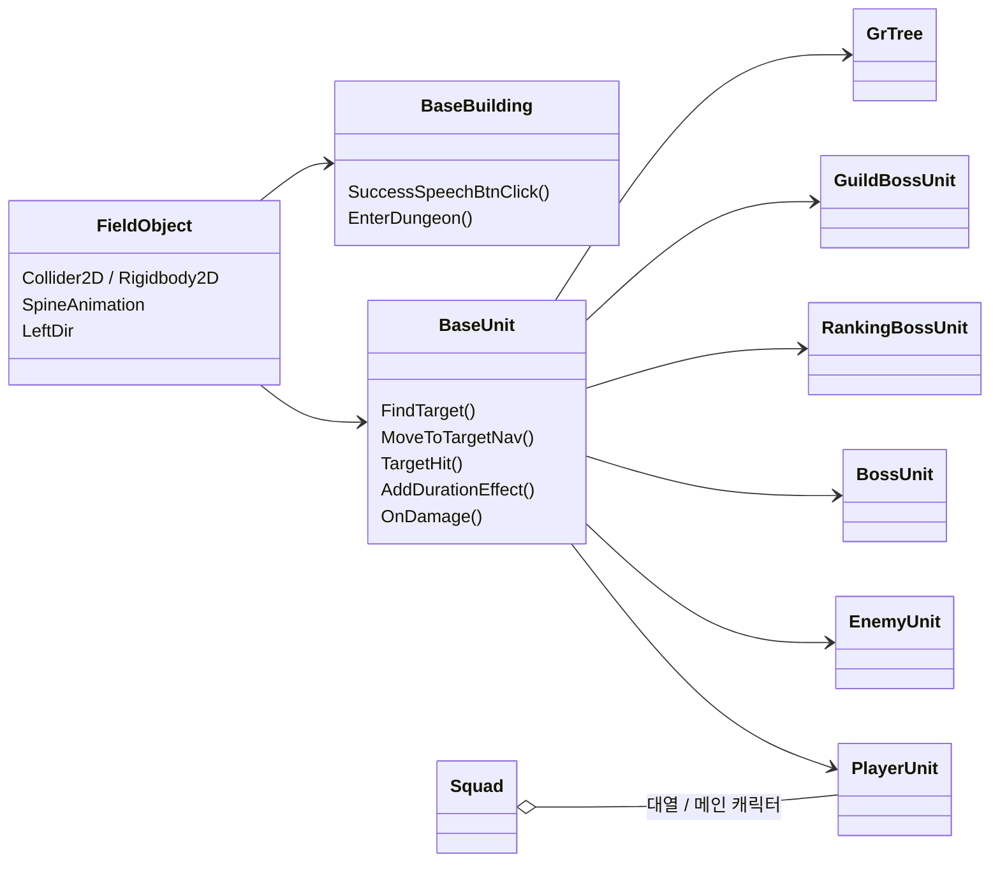
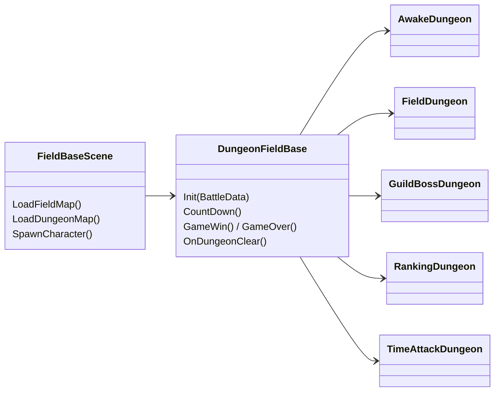
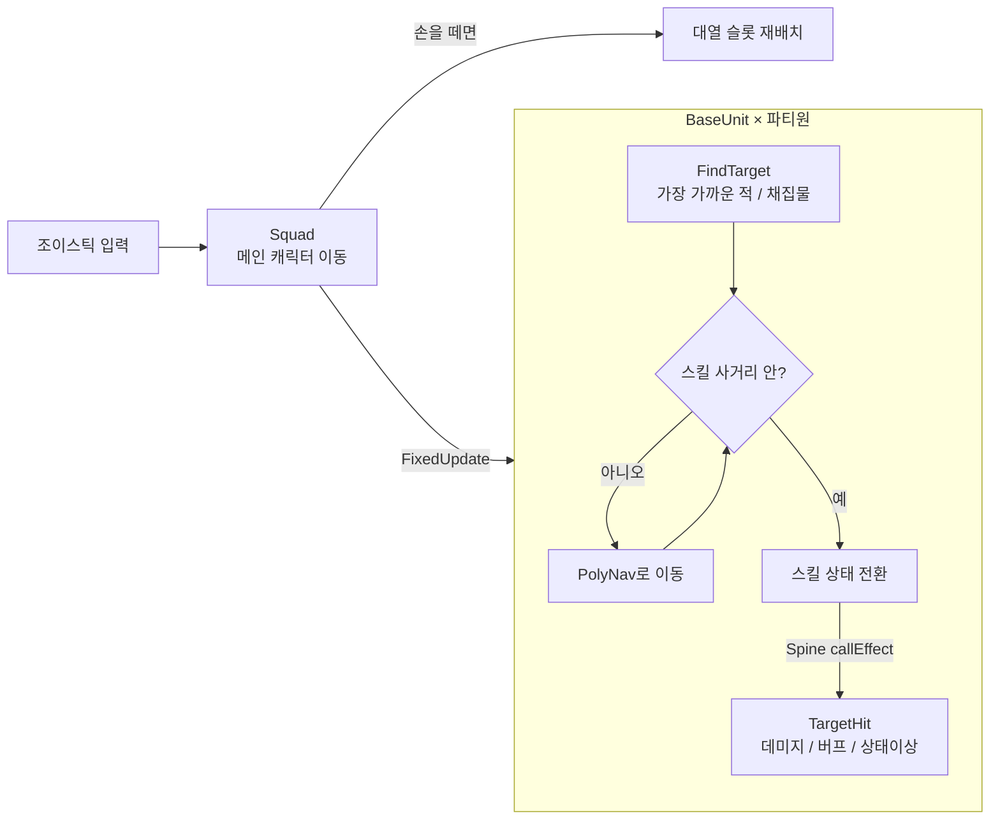

# 전우치 - 도사열전 — 필드 전투 클라이언트 코드

<p align="center">
  <a href="https://www.youtube.com/watch?v=1vTQRDaasaY">
    
  </a>
  <br>
  <sub>▶ 트레일러 (이미지를 누르면 YouTube에서 재생됩니다)</sub>
</p>

> 수집형 RPG **「전우치 - 도사열전」** 클라이언트 개발 중 담당한 **필드 전투 / 스쿼드 / 던전** 코드를 포트폴리오용으로 정리한 문서입니다.
> **우르르 용병단과 같은 스쿼드형 필드 전투**로, 조이스틱으로 메인 캐릭터를 움직이면 파티 전체가 대열을 지어 함께 이동하고, 적을 만나면 캐릭터마다 자동으로 싸우는 방식입니다.
> 전체 프로젝트가 아닌 담당 파트 일부이며, 매니저·데이터 테이블·스킬·UI 등 외부 의존 코드는 포함되어 있지 않아 단독으로 빌드되지 않습니다.
>
> 📂 **전체 코드는 요청 시 공유 가능합니다.** (비공개 저장소 — 요청해 주시면 열람 권한을 드립니다)

## 프로젝트 정보

| 항목 | 내용 |
| --- | --- |
| 장르 | 수집형 RPG (스쿼드형 실시간 필드 전투) |
| 플랫폼 | Android, IOS |
| 개발 기간 | 2025.01 ~ 2026.05 |
| 팀 구성 | 클라이언트 3명, 서버 1명, 기획 2명 아트 2명 |
| 개발 환경 | Unity3D 2022.3.62 |
| 사용 에셋 및 라이브러리 | UGUI, Spine, BestHTTP, UniRx, UniTask, Addressable System, PolyNavMesh, TileMap |
| 담당 역할 | Unity 클라이언트 — 전투 로직, 필드 / 던전, 컨텐츠, Addressable 패치 시스템, 일정 관리 |

## 기술 스택

- **Engine**: Unity3D 2022.3.62
- **Language**: C#
- **UI**: UGUI
- **Map**: TileMap (필드 / 던전 맵, 이벤트 타일)
- **Async**: UniTask (async/await 기반 로딩·연출), UniRx (ReactiveProperty로 상태 구독)
- **Animation**: Spine (캐릭터 / 건물 애니메이션, 애니메이션 이벤트로 타격 시점 판정)
- **Pathfinding**: PolyNavMesh (2D 내비메시 기반 자동 전투 길찾기)
- **Resource**: Addressable System (DB, Spine, Prefab, Atlas Texture 패치)
- **Network**: BestHTTP

## 주요 업무

**전투 로직 개발**

| 업무 | 관련 코드 |
| --- | --- |
| 캐릭터 FSM (Idle, Move, Hit, Attack, ActiveSkill, Passive, Death, Stun, Farming) | [`StateMachine.cs`](https://github.com/jinhwan322/ktf_document/blob/main/Assets/Scripts/Battle/StateMachine.cs), [`BaseUnit.cs`](https://github.com/jinhwan322/ktf_document/blob/main/Assets/Scripts/Unit/BaseUnit.cs) |
| 스킬 효과 (데미지, 버프, 디버프, 도트 데미지, 상태이상, 회복) | [`BaseUnit.cs`](https://github.com/jinhwan322/ktf_document/blob/main/Assets/Scripts/Unit/BaseUnit.cs) |
| 필드 및 던전 구현 | [`FieldBaseScene.cs`](https://github.com/jinhwan322/ktf_document/blob/main/Assets/Scripts/Field/FieldBaseScene.cs), [`DungeonFieldBase.cs`](https://github.com/jinhwan322/ktf_document/blob/main/Assets/Scripts/Field/DungeonFieldBase.cs) |
| PolyNavMesh를 이용한 자동 전투 길찾기 | [`BaseUnit.cs`](https://github.com/jinhwan322/ktf_document/blob/main/Assets/Scripts/Unit/BaseUnit.cs), [`Squad.cs`](https://github.com/jinhwan322/ktf_document/blob/main/Assets/Scripts/Unit/Squad.cs) |

**필드 개발**

| 업무 | 관련 코드 |
| --- | --- |
| 필드, 던전 | [`FieldBaseScene.cs`](https://github.com/jinhwan322/ktf_document/blob/main/Assets/Scripts/Field/FieldBaseScene.cs), [`DungeonFieldBase.cs`](https://github.com/jinhwan322/ktf_document/blob/main/Assets/Scripts/Field/DungeonFieldBase.cs) |
| 건물, 워프, 포탈 | [`BaseBuilding.cs`](https://github.com/jinhwan322/ktf_document/blob/main/Assets/Scripts/Unit/BaseBuilding.cs), [`Squad.cs`](https://github.com/jinhwan322/ktf_document/blob/main/Assets/Scripts/Unit/Squad.cs) |
| 몬스터 | [`BaseUnit.cs`](https://github.com/jinhwan322/ktf_document/blob/main/Assets/Scripts/Unit/BaseUnit.cs) |
| 이벤트 타일 | |

**Addressable을 이용한 패치 시스템 개발** (DB, Spine, Prefab, Atlas Texture) — [`AddressableDownloader.cs`](https://github.com/jinhwan322/ktf_document/blob/main/Assets/Scripts/Addressables/AddressableDownloader.cs), [`AddressableBundleloader.cs`](https://github.com/jinhwan322/ktf_document/blob/main/Assets/Scripts/Addressables/AddressableBundleloader.cs)

**기타**

- 컨텐츠 개발: 가챠, 유물 시스템
- 프로젝트 일정 관리 및 조율

## 인게임 스크린샷

<p align="center">
  
</p>

- 조이스틱(하단)으로 메인 캐릭터를 움직이면 파티원들이 대열을 지어 함께 이동하고, 적을 만나면 각자 자동으로 전투
- 필드 위에서 몬스터 처치·채집과 퀘스트가 이어지는 구조
- 필드에 놓인 건물에 다가가 상호작용, 오른쪽 메뉴에서 창고·임무·도전·훈련·지도 등 컨텐츠 진입

## 클래스 구조





| 베이스 | 상속 클래스 |
| --- | --- |
| `BaseUnit` | PlayerUnit, EnemyUnit, BossUnit, RankingBossUnit, GuildBossUnit, GrTree |
| `BaseBuilding` | InstallationBuilding, StorageBuilding, PortalBuilding, FieldDungeonBuilding, FogDungeonBuilding, FogPointBuilding, FieldQuestBuilding, RewardBoxBuilding, TreasureBoxBuilding |
| `DungeonFieldBase` | AwakeDungeon, FieldDungeon, GuildBossDungeon, RankingDungeon, TimeAttackDungeon |

- 공통 흐름(탐색·이동·스킬·피격 / 던전 진행 / 건물 상호작용)은 베이스 클래스에 두고, 종류별 차이(보스 패턴, 던전 승리 조건, 건물 기능)만 상속 클래스에서 구현
- 상속 클래스는 이 저장소에 포함되어 있지 않습니다.

## 전투 흐름



## 핵심 구현 포인트

### 1. 우르르 용병단식 스쿼드 이동 — [`Squad.cs`](https://github.com/jinhwan322/ktf_document/blob/main/Assets/Scripts/Unit/Squad.cs)
- 조이스틱을 누르는 순간 스쿼드 중심에 가장 가까운 캐릭터를 **메인 캐릭터**로 정하고, 메인 캐릭터만 입력을 따라 이동
- 나머지 캐릭터는 메인 캐릭터 기준 **대열 슬롯**(중심 → 상하좌우 → 대각선 → 바깥)을 따라가며, 손을 떼면 슬롯을 다시 계산해 제자리로 복귀
- 자동 모드에서는 적이 남아 있는 가장 가까운 스폰 포인트로 이동
- 존(구역) 경계를 넘으면 마을 / 필드 모드 전환, 대화 이벤트, 날씨 연출을 처리

### 2. 많은 유닛을 위한 탐색 / 경로 최적화 — [`BaseUnit.cs`](https://github.com/jinhwan322/ktf_document/blob/main/Assets/Scripts/Unit/BaseUnit.cs)
- **문제**: 필드에 아군 파티와 몬스터가 많아 매 프레임 타겟 탐색과 A* 경로 계산을 하면 부하가 큼
- **해결**
  - 타겟 탐색은 `OverlapCircle` + 직선 거리(`sqrMagnitude`) 비교로 A* 없이 처리하고, 현재 타겟이 살아 있으면 5프레임마다만 다시 찾음
  - PolyNav 내부의 매 프레임 재탐색을 끄고, 목적지 갱신을 10프레임 주기로 직접 관리
  - 전투 유닛과 채집물이 같이 있으면 전투 유닛을 우선 타겟으로 선택

### 3. Spine 이벤트 기반 다단 타격과 범위 미리보기 — [`StateMachine.cs`](https://github.com/jinhwan322/ktf_document/blob/main/Assets/Scripts/Battle/StateMachine.cs)
- 스킬 애니메이션의 `callEffect` 이벤트 시간을 미리 뽑아 두고 **FixedUpdate 고정 틱 시간**과 비교해 타격 판정
- 이벤트가 여러 개인 스킬은 이벤트마다 다음 타격 단계(스킬 디테일)로 넘어가고, 다음 타격까지 남은 시간 동안 **공격 범위(Spell Indicator)**를 미리 표시

### 4. 지속 효과 / 상태이상 시스템 — [`BaseUnit.cs`](https://github.com/jinhwan322/ktf_document/blob/main/Assets/Scripts/Unit/BaseUnit.cs)
- 버프·디버프를 id별 중첩 목록으로 관리하고 효과마다 최대 중첩 수 제한
- 상태이상(스턴, 속박, 빙결 등)은 배열 플래그로 빠르게 확인하고, 같은 상태이상을 주는 다른 효과가 남아 있으면 해제하지 않음
- 버프 면역 / 패시브 면역 / 보스 상태이상 무시, 무적, 불사(HP 1 유지), 장판 효과, 넉백 지원

### 5. 던전 공통 흐름 — [`DungeonFieldBase.cs`](https://github.com/jinhwan322/ktf_document/blob/main/Assets/Scripts/Field/DungeonFieldBase.cs)
- 던전 규칙(DB)으로 제한 시간·부활 횟수·조이스틱 / 자동 전투 허용 여부를 정하고, 맵 → UI → 스쿼드 → 캐릭터 → 전투 순서로 비동기 준비
- 카운트다운 → 전투 → 승리 / 패배 → 결과(다음 단계, 재도전, 필드 복귀) 흐름을 베이스에서 처리하고, 던전별 승리 조건만 상속 클래스에서 구현

### 6. Addressable 패치 시스템 (CDN 전환 가능) — [`AddressableDownloader.cs`](https://github.com/jinhwan322/ktf_document/blob/main/Assets/Scripts/Addressables/AddressableDownloader.cs)
- 번들 요청 URL에서 빌드 시점의 CDN 주소(개발 / 라이브)를 떼어 내고 현재 다운로드 URL로 바꿔서, **번들을 다시 빌드하지 않고 CDN을 전환**
- DB, Spine, Prefab, Atlas Texture를 라벨 단위로 패치하고, 다운로드 크기 확인 → 다운로드 → 진행도 표시 흐름을 이벤트로 알림
- 플랫폼별 카탈로그를 직접 로드하고 예전 로케이터는 제거, 로드 후 같은 번들의 예전 캐시 버전을 정리

## 파일 구성

```
Assets/Scripts/
├── Unit/
│   ├── FieldObject.cs           # 필드 오브젝트 베이스 (2D 물리, Spine, 방향, 정렬)
│   ├── BaseUnit.cs              # 전투 유닛 베이스 (탐색, 경로 이동, 스킬, 지속 효과, 피격)
│   ├── Squad.cs                 # 플레이어 스쿼드 (메인 캐릭터, 대열, 조이스틱, 자동 모드, 존 전환)
│   └── BaseBuilding.cs          # 필드 건물 베이스 (상호작용, 던전 입장, 생산 정산)
├── Battle/
│   └── StateMachine.cs          # 유닛 FSM, Spine 이벤트 기반 타격 판정
├── Field/
│   ├── FieldBaseScene.cs        # 필드 / 던전 씬 공통 (스쿼드, 카메라, 맵 로드, 캐릭터 스폰)
│   └── DungeonFieldBase.cs      # 던전 공통 흐름 (규칙, 카운트다운, 승패, 결과)
└── Addressables/
    ├── AddressableDownloader.cs # 카탈로그 갱신, 번들 다운로드, CDN URL 변환
    └── AddressableBundleloader.cs # 번들 로드, 진행도, 캐시 정리
```

## 참고

- 회사 프로젝트 코드 중 본인이 담당한 부분만 발췌했으며, 서버 주소와 키 같은 민감 정보는 포함하지 않았습니다.
- 공개를 위해 주석을 추가하고 일부 코드를 정리했습니다. (중복 코드 통합, 미사용 코드 제거, 일부 버그 수정)
