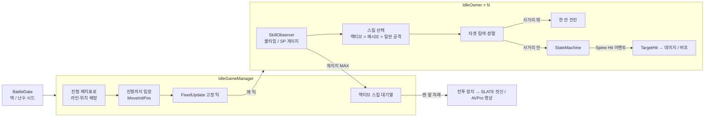
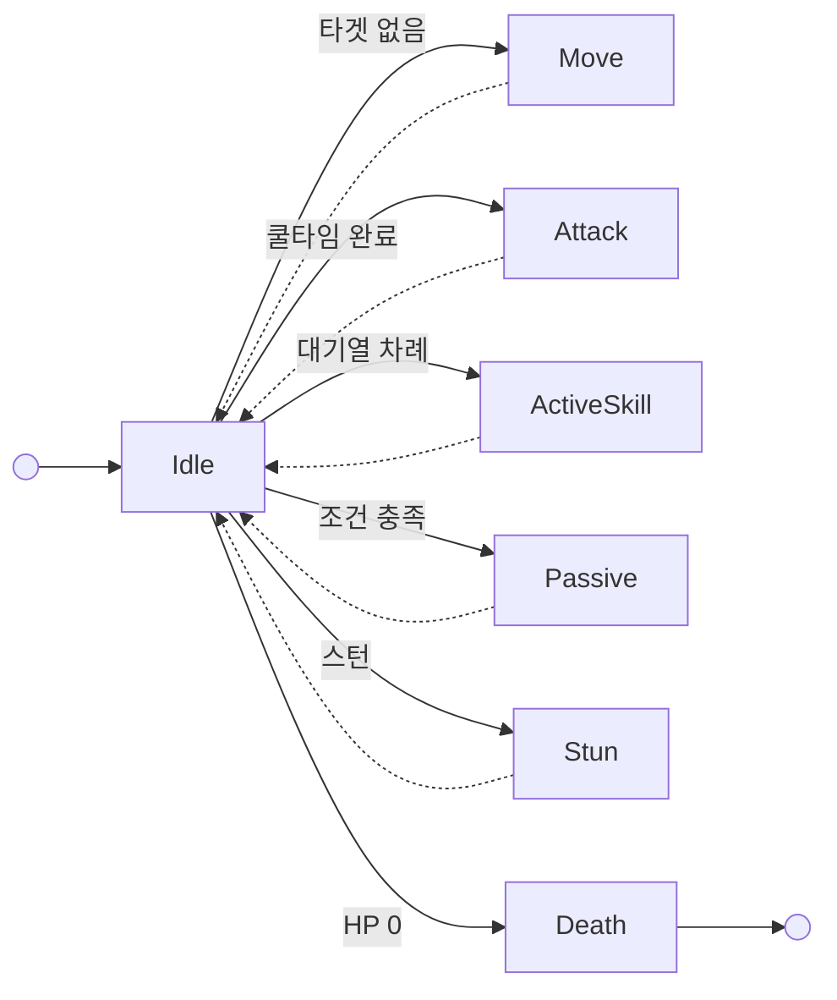

# OVE GENERATION — 전투 클라이언트 코드

<p align="center">
  <a href="https://www.youtube.com/watch?v=EyL76rR3eRg&t=34s">
    
  </a>
  <br>
  <sub>▶ 트레일러 (이미지를 누르면 YouTube에서 재생됩니다)</sub>
</p>

> 미소녀 수집형 RPG **「OVE GENERATION」** 클라이언트 개발 중 담당한 **전투 시스템** 코드를 포트폴리오용으로 정리한 문서입니다.
> **프린세스 커넥트(프리코네)와 같은 실시간 사이드 뷰 오토 배틀**로, 캐릭터가 알아서 전진·공격하고 게이지가 찬 캐릭터의 필살기를 직접 또는 자동으로 발동하는 방식입니다.
> 전체 프로젝트가 아닌 담당 파트 일부이며, 데이터 테이블·UI·서버 통신 등 외부 의존 코드는 포함되어 있지 않아 단독으로 빌드되지 않습니다.
>
> 📂 **전체 코드는 요청 시 공유 가능합니다.** (비공개 저장소 — 요청해 주시면 열람 권한을 드립니다)

## 프로젝트 정보

| 항목 | 내용 |
| --- | --- |
| 장르 | 미소녀 수집형 RPG (실시간 사이드 뷰 오토 배틀) |
| 플랫폼 | Android, IOS, WebGL, Windows |
| 개발 기간 | 2019.01 ~ 2020.02 |
| 팀 구성 | 클라이언트 5명, 서버 3명, 기획 5명 아트 10명 |
| 개발 환경 | Unity3D 2018.4.10 |
| 사용 에셋 및 라이브러리 | NGUI, Spine, BestHTTP, UniRx, AVPro Video, Easy Movie Texture, SLATE Cinematic Sequencer |
| 담당 역할 | Unity 클라이언트 — 전투 로직, 캐릭터 FSM, 스킬, 전투 연출, iOS 세팅 |

## 성과

- **2020.01** — OVE GENERATION DMM 런칭
- **2020.10** — 여신의 키스-OVE 글로벌 런칭

## 기술 스택

- **Engine**: Unity3D 2018.4.10
- **Language**: C#
- **Animation**: Spine (캐릭터 애니메이션, 애니메이션 이벤트로 타격 시점 판정)
- **Time Control**: Chronos (유닛 / 이펙트 글로벌 클럭으로 배속·일시정지·스킬 연출 제어)
- **Cinematic**: SLATE Cinematic Sequencer (액티브 스킬 컷신), AVPro Video / Easy Movie Texture (액티브 스킬 영상)
- **UI**: NGUI, UniRx
- **Network**: BestHTTP

## 주요 업무

**전투 시스템 개발**

| 업무 | 관련 코드 |
| --- | --- |
| 전투 로직 (실시간 사이드 뷰 오토 배틀) | [`IdleGameManager.cs`](https://github.com/jinhwan322/OVE_document/blob/main/Assets/Scripts/Battle/IdleGameManager.cs), [`IdleOwner.cs`](https://github.com/jinhwan322/OVE_document/blob/main/Assets/Scripts/Battle/IdleOwner.cs) |
| 캐릭터 FSM (Idle, Move, Attack, ActiveSkill, Passive, Death, Stun) | [`StateMachine.cs`](https://github.com/jinhwan322/OVE_document/blob/main/Assets/Scripts/Battle/StateMachine.cs), [`FSM_State.cs`](https://github.com/jinhwan322/OVE_document/blob/main/Assets/Scripts/Battle/FSM_State.cs) |
| 스킬 / 쿨타임 관리 | [`SkillObserver.cs`](https://github.com/jinhwan322/OVE_document/blob/main/Assets/Scripts/Battle/SkillObserver.cs) |
| 스킬 효과 (데미지, 버프 등) | [`ObjectBase.cs`](https://github.com/jinhwan322/OVE_document/blob/main/Assets/Scripts/Battle/ObjectBase.cs), [`IdleOwner.cs`](https://github.com/jinhwan322/OVE_document/blob/main/Assets/Scripts/Battle/IdleOwner.cs) |
| 전투 연출 (SLATE Cinematic Sequencer, AVPro, Easy Movie) | [`IdleGameManager.cs`](https://github.com/jinhwan322/OVE_document/blob/main/Assets/Scripts/Battle/IdleGameManager.cs) |

**기타**

- BestHTTP를 사용한 서버 통신
- iOS 세팅 (Apple 로그인, 결제, 푸시, 빌드 세팅)
- 클라이언트 내부 일정 관리

## 전투 시뮬레이션 스크린샷

<p align="center">
  
</p>

- 아군(왼쪽)과 적군(오른쪽)이 사이드 뷰로 마주 보고, 사거리에 들어오면 자동으로 공격
- 피격 시 데미지 숫자와 적군 머리 위 HP 바 / 버프 아이콘 표시
- 하단 슬롯: 아군 캐릭터별 HP(초록) / 필살기 SP 게이지(파랑), 속성 아이콘
- 오른쪽 버튼: AUTO(필살기 자동 사용), X2(배속), Start / Pause / Reset(시뮬레이션 제어)

## 전투 구조





| 상태 | 진입 조건 | 종료 → Idle |
| --- | --- | --- |
| Move | 사거리 안에 타겟 없음 | 한 칸 이동 완료 |
| Attack | 일반 공격 쿨타임 완료 | 공격 애니메이션 종료 |
| ActiveSkill | 스킬 대기열 차례 (필살기) | 컷신 / 스킵 처리 종료 |
| Passive | 패시브 발동 조건 충족 | 패시브 애니메이션 종료 |
| Stun | 스턴 디버프 | 지속 시간 종료 |
| Death | HP 0 | — |

- **IdleGameManager**: 유닛 생성, 진형 배정, 고정 틱 진행, 액티브 스킬 대기열, 컷신·영상 재생, 승패 판정
- **IdleOwner / ObjectBase**: 전투 유닛. 스탯·버프 계산(ObjectBase)과 이동·타겟팅·공격·피격(IdleOwner)
- **SkillObserver**: 캐릭터별 스킬 쿨타임과 필살기 SP 게이지 관리
- **StateMachine**: 상태 전환과 Spine 애니메이션 이벤트 기반 타격 판정

## 핵심 구현 포인트

### 1. 고정 틱 + 시드 난수로 같은 결과가 나오는 전투 — [`IdleGameManager.cs`](https://github.com/jinhwan322/OVE_document/blob/main/Assets/Scripts/Battle/IdleGameManager.cs), [`StateMachine.cs`](https://github.com/jinhwan322/OVE_document/blob/main/Assets/Scripts/Battle/StateMachine.cs)
- **문제**: 오토 배틀은 배속(x1 / x2), 프레임 저하, 필살기 연출 정지가 섞여 있어 `Update` 기준으로 계산하면 같은 덱이라도 결과가 달라질 수 있음
- **해결**
  - 전투 진행(쿨타임, 이동, 타격 판정)을 모두 `FixedUpdate` 고정 틱으로 처리
  - 치명타·회피·버프 확률은 서버가 내려준 **시드 고정 난수**(`Shared.Battle.Random`)로 굴리고, 호출 순서를 고정
  - 타격 시점은 렌더링된 애니메이션이 아니라 Spine 애니메이션 데이터에서 미리 뽑아 둔 이벤트 시간을 고정 틱 누적 시간과 비교해 판정
  ```csharp
  time += Time.fixedDeltaTime;
  if (hitIndex < hitTime.Count && time >= hitTime[hitIndex].time)
  {
      if (hitTime[hitIndex].name == "Hit")
          owner.TargetHit();      // 애니메이션의 Hit 이벤트 시점에 데미지 판정
      hitIndex++;
  }
  ```
- **효과**: 배속이나 프레임 저하와 관계없이 같은 입력이면 같은 전투 결과가 나옴

### 2. 프리코네식 필살기 대기열 — [`SkillObserver.cs`](https://github.com/jinhwan322/OVE_document/blob/main/Assets/Scripts/Battle/SkillObserver.cs), [`IdleGameManager.cs`](https://github.com/jinhwan322/OVE_document/blob/main/Assets/Scripts/Battle/IdleGameManager.cs)
- 필살기 쿨타임을 SP 게이지로 보여 주고, 게이지가 찬 캐릭터는 **스킬 대기열**에 들어감
- 수동 모드에서는 슬롯을 눌러 대기열에 넣고, 오토 모드나 적군은 자동으로 넣음
- 한 편에서 **한 번에 한 명만** 필살기를 쓰고(대기열 맨 앞), 아군 슬롯에는 대기 순번을 표시
- 스턴·침묵에 걸리거나 사망하면 대기열에서 빠짐

### 3. 필살기 연출과 전투 시간 분리 — [`IdleOwner.cs`](https://github.com/jinhwan322/OVE_document/blob/main/Assets/Scripts/Battle/IdleOwner.cs), [`IdleGameManager.cs`](https://github.com/jinhwan322/OVE_document/blob/main/Assets/Scripts/Battle/IdleGameManager.cs)
- 필살기를 쓰면 전투 틱을 멈추고 Chronos 글로벌 클럭으로 유닛 / 이펙트 시간을 연출용으로 전환
- SLATE로 시전자와 타겟을 배치한 컷신을 재생하고, 캐릭터 전용 영상이 있으면 컷신을 잠시 멈추고 AVPro로 재생한 뒤 이어서 재생
- 스킵 배속에서는 컷신 없이 모든 타격을 즉시 처리하고 전투를 재개
- 연출 중에 HP가 0이 된 유닛은 사망 처리를 미뤘다가 연출이 끝난 뒤 처리해 컷신이 끊기지 않게 함

### 4. 진형 배치표와 좌우 반전 — [`IdleGameManager.cs`](https://github.com/jinhwan322/OVE_document/blob/main/Assets/Scripts/Battle/IdleGameManager.cs)
- 전장은 **라인 1\~3 × 위치 1\~12** 격자 (아군 1\~6, 적군 7\~12)
- 전열 / 중열 / 후열 인원수(1\~6명)마다 배치 칸을 정한 **배치표**로 진형을 배정
- 적군은 배치표를 따로 만들지 않고, 아군 배치표의 위치를 **13에서 뺀 값**으로 바꿔 좌우 대칭으로 사용
  - 예: 아군 최전방 위치 6 ↔ 적군 최전방 위치 7, 아군 최후방 위치 1 ↔ 적군 최후방 위치 12
  - 배치표 하나만 관리하면 되고, 아군과 적군의 진형이 항상 같은 모양으로 마주 봄
  ```csharp
  int pos = isEnemy ? MirrorPosNumber - slots[i].pos : slots[i].pos;
  ```
- 사거리 안에 타겟이 없으면 적 방향으로 한 칸씩 전진하고, 앞 칸을 같은 편이 차지하고 있으면 빌 때까지 대기

### 5. 스킬 데이터 기반 타겟팅 — [`IdleOwner.cs`](https://github.com/jinhwan322/OVE_document/blob/main/Assets/Scripts/Battle/IdleOwner.cs)
- 스킬마다 타겟 타입(자신 / 아군 / 적군, 포지션 순서), 타겟 조건, 타겟 수, 효과 1·2를 기획 데이터로 설정
- 후보를 단계별 비교로 정렬해 앞에서부터 타겟 수만큼 선택
  1. 도발에 걸렸으면 도발한 상대
  2. 타겟 조건 (가까운 순, 공격력 / 방어력 / HP 높은·낮은 순, 특정 상태이상 보유)
  3. 포지션 순서 (예: 전열 → 중열 → 후열)
  4. 속성 상성 (유리한 속성 우선)

### 6. 버프 / 상태이상 시스템 — [`ObjectBase.cs`](https://github.com/jinhwan322/OVE_document/blob/main/Assets/Scripts/Battle/ObjectBase.cs)
- 스킬 버프, 조건부 버프, 장비 버프, 장비 스킬 버프를 따로 관리하고, `원본 스탯 + 버프 합계`로 최종 스탯 계산
- 스턴·침묵·도발·무적·보호막(수치형 / HP 비례형)·도트 데미지 / 힐 지원
- CC·면역 계열은 스킬 레벨에 따라 발동 확률이 오름

## 파일 구성

```
Assets/Scripts/Battle/
├── IdleGameManager.cs   # 전투 진행 관리 (유닛 생성, 진형 배치표, 고정 틱, 스킬 대기열, 컷신·영상, 승패)
├── IdleOwner.cs         # 전투 유닛 (스킬 선택, 이동, 타겟팅, 공격, 피격, 발사체, 이펙트)
├── ObjectBase.cs        # 유닛 베이스 (스탯, 데미지 계산, 버프 / 상태이상)
├── SkillObserver.cs     # 스킬 쿨타임 / 필살기 SP 게이지
├── StateMachine.cs      # 캐릭터 FSM, Spine 이벤트 기반 타격 판정
└── FSM_State.cs         # FSM 상태 베이스
```

## 참고

- 회사 프로젝트 코드 중 본인이 담당한 부분만 발췌했으며, 서버 주소와 키 같은 민감 정보는 포함하지 않았습니다.
- 공개를 위해 주석을 추가하고 일부 코드를 정리했습니다. (중복 코드 통합, 미사용 코드 제거, 일부 버그 수정)
